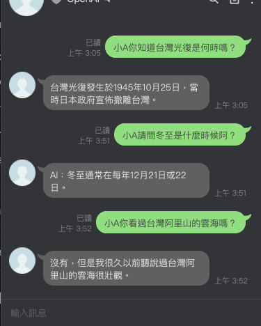

# LineBotChatGPT
utilized openai api for implementation of chatGPT with LineBot

## Work Environment for myself
- `Python 3.10.4`
- `go version go1.18.1 darwin/amd64`

## Usage

```shell
git clone https://github.com/TaroballzChen/LineBotChatGPT
pip3 install openai python-dotenv
cd LineBotChatGPT
touch .env
echo ChannelSecret=your_LINE_ChannelSecret >> .env
echo ChannelAccessToken=your_LINE_ChannelAccessToken >> .env
echo OpenApiKey=your_OpenApiKey >>.env
echo WriteHistory=1 # 1 for WriteHistory to history.txt, 0 for NO
go run main.go
```

then use `ngrok` or other method(cloud container, nginx with certbot etc.) exposed `80` port to public network with SSL 

enjoy!

### Dockerfile
1. download the `Dockerfile` in this project
2. `docker build --no-cache -t LineBotChatGPT:latest .`
3. `docker run -p 8080:80 -v $PWD/.env:/LineBotChatGPT/.env -v $PWD/history.txt:/LineBotChatGPT/history.txt LineBotChatGPT`
then use `ngrok` or other method(cloud container like railway.app, Heroku or nginx with certbot etc.) exposed `80` port to public network with SSL

enjoy!

### Railway.app Deploy
TODO:


## result


## Reference
1. https://github.com/kkdai/linebot-group
2. https://github.com/kkdai/LineBotTemplate
3. https://www.learncodewithmike.com/2020/06/python-line-bot.html